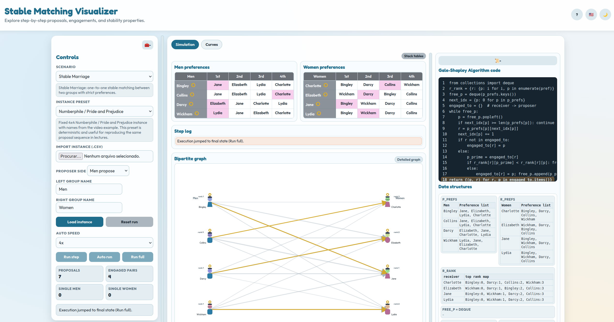

# Stable Matching Visualizer

<p align="right">
  <a href="README.md">English</a> |
  <strong>Português (Brasil)</strong>
</p>

Stable Matching Visualizer é uma ferramenta web educacional para estudar modelos de emparelhamento estável com execução passo a passo, tabelas/grafos sincronizados, contadores alinhados ao algoritmo e curvas empíricas de complexidade.

🔗 Live demo: https://brunogrisci.github.io/stablematching
🔗 Repositório no GitHub: https://github.com/BrunoGrisci/stable-matching-visualizer



## Funcionalidades

- Cinco cenários na mesma interface:
  - Casamento estável (clássico um-para-um).
  - Categorias boas e ruins.
  - Pares proibidos.
  - Pareamento de residentes (capacidades e aplicações limitadas).
  - Colegas de quarto estáveis (algoritmo de Irving).
- Execução algorítmica adaptada por cenário:
  - Engine de Gale-Shapley para os cenários bipartidos.
  - Engine de Irving para Stable Roommates (Fase 1 de propostas, redução da Fase 1 e eliminação de rotações na Fase 2).
  - Retorno antecipado no Irving quando a Fase 1 já termina com pares mútuos de primeira escolha.
- Controles de execução e ritmo:
  - `Executar passo`, `Auto executar` e `Executar completo`.
  - Velocidade de execução ajustável.
  - Log completo de passos com explicações textuais.
- Curvas e contadores alinhados ao algoritmo selecionado:
  - Cenários com Gale-Shapley: curvas/contadores baseados em propostas.
  - Colegas de quarto estáveis: operações de Irving `P + D + R` (propostas, deleções de preferência e rotações encontradas).
- Visualizações didáticas sincronizadas:
  - Tabelas de preferência com destaques, aceitação/rejeição e nomes riscados quando removidos.
  - Grafo bipartido para cenários de dois lados.
  - Grafo completo circular para roommates, com arestas removidas tracejadas e marcações de noivado/rompimento (`O` / `∅`).
  - Painel dedicado de rastreio da Fase 2 do Irving (construção do ciclo + progresso da eliminação).
- Apoio pedagógico:
  - Pseudocódigo com destaque de linha ativa.
  - Cartões de estruturas de dados.
  - Painel de insights de corretude.
  - Presets de instância, tabelas editáveis e importação/exportação CSV.
- Usabilidade e acessibilidade:
  - Temas claro e escuro.
  - Localização em Inglês / Português (Brasil).
  - Painéis recolhíveis e divisores redimensionáveis.

## Objetivos pedagógicos

- Tornar concretos e inspecionáveis os processos de aceitação diferida e eliminação de rotações.
- Comparar diferentes modelos de matching em uma UI unificada, preservando a semântica de cada algoritmo.
- Conectar operações do pseudocódigo às mudanças visíveis em tabelas, arestas do grafo, contadores e log.
- Apoiar demonstrações em sala com presets determinísticos e rastros reproduzíveis.
- Incentivar análise empírica de complexidade com benchmarks na aba de curvas.

## Stack tecnológica

- HTML5
- CSS3 (estilização responsiva customizada)
- JavaScript Vanilla (ES6+)

## Estrutura do projeto

- `stablematching.html`: página principal.
- `stablematching/css/style.css`: estilos completos da interface.
- `stablematching/js/i18n.js`: dicionário de localização EN / pt-BR.
- `stablematching/js/algorithms.js`: engines de Gale-Shapley e Irving, geradores e parser/exportador CSV.
- `stablematching/js/main.js`: estado da UI, renderização, controles, stepping e fluxo de curvas.

## Uso

1. Abra `stablematching.html` no navegador (ou sirva o repositório com um servidor estático).
2. Selecione o `Cenário` e o `Preset de instância`, depois clique em `Carregar instância`.
3. Execute com `Executar passo`, `Auto executar` ou `Executar completo`.
4. Inspecione pseudocódigo, estruturas de dados, tabelas de preferências, atualizações no grafo e insights de corretude.
5. Use a aba `Curvas` para benchmark das famílias aleatória/inversa/fácil/pior caso.

## Formato CSV

Cabeçalho:

```csv
group,name,prefs,capacity,category
```

Tipos de linha suportados:

- `men` / `women` (aliases: `m`, `w`, `man`, `woman`)
- `roommates` (aliases: `roommate`, `r`)
- `forbidden,man,woman`

Regras:

- `prefs` usa separador `|`.
- `capacity` se aplica aos cenários de dois lados (padrão `1`).
- `category` aceita `good` / `bad` no cenário Good/Bad.
- Em linhas de roommates, `capacity` e `category` são ignorados.

Exemplo mínimo de CSV para roommates:

```csv
group,name,prefs,capacity,category
roommates,A,B|D|F|C|E,,
roommates,B,D|E|F|A|C,,
roommates,C,D|E|F|A|B,,
roommates,D,F|C|A|E|B,,
roommates,E,F|C|D|B|A,,
roommates,F,A|B|D|C|E,,
```

## Créditos

Desenvolvido por Prof. Bruno Iochins Grisci  
Departamento de Informática Teórica  
Instituto de Informática – Universidade Federal do Rio Grande do Sul (UFRGS)  
🔗 https://brunogrisci.github.io/  
🔗 https://www.inf.ufrgs.br/site/  
🔗 https://www.ufrgs.br/site/

## Nota de desenvolvimento

Esta ferramenta web foi criada com a assistência de IA Generativa (GPT-5.3-Codex).

## Referências

**Referências principais**
- Gale, David; Shapley, Lloyd S. "College Admissions and the Stability of Marriage." *The American Mathematical Monthly* 69(1), 1962.
- Kleinberg, Jon; Tardos, Éva. *Algorithm Design*. Addison-Wesley (Pearson), 2005.
- Irving, Robert W. "An efficient algorithm for the stable roommates problem." *Journal of Algorithms* 6(4), 1985. https://doi.org/10.1016/0196-6774(85)90033-1

**Outras referências**
- Princeton Gale-Shapley demo: https://www.cs.princeton.edu/~wayne/kleinberg-tardos/pdf/01DemoGaleShapley.pdf
- Stable Marriage Problem (Numberphile): https://www.youtube.com/watch?v=Qcv1IqHWAzg
- Stable roommates problem (Wikipedia): https://en.wikipedia.org/wiki/Stable_roommates_problem
- Irving's Algorithm and Stable Roommates Problem: https://www.youtube.com/watch?v=5QLxAp8mRKo

## Licença

Este projeto está licenciado sob a MIT License.  
Você pode usar, modificar e redistribuir para fins acadêmicos e educacionais, desde que a devida atribuição seja mantida.  
Consulte o arquivo LICENSE para detalhes.

## Citação

Se você usar esta ferramenta em trabalhos acadêmicos (artigos, teses, relatórios técnicos ou material didático), cite como:

Grici, Bruno Iochins. *Stable Matching Visualizer*. Ferramenta educacional web, 2026. Disponível em: https://github.com/BrunoGrisci/stable-matching-visualizer

```bibtex
@misc{grisci_stable_matching_visualizer_2026,
  author       = {Bruno Iochins Grisci},
  title        = {Stable Matching Visualizer},
  year         = {2026},
  howpublished = {\url{https://github.com/BrunoGrisci/stable-matching-visualizer}},
  note         = {Educational web tool}
}
```

## Veja também

**Karatsuba Multiplication Visualizer**  
Web app: https://brunogrisci.github.io/karatsuba  
Repository: https://github.com/BrunoGrisci/karatsuba_visualization  
Ferramenta educacional para comparar multiplicação escolar e Karatsuba com decomposição passo a passo e curvas de operações.

**Cashier's Algorithm Game**  
Web app: https://brunogrisci.github.io/cashiers  
Repository: https://github.com/BrunoGrisci/cashiers_algorithm_game  
Jogo educacional que compara abordagens Gulosa e Programação Dinâmica para o problema de troco.

**Projeto e Análise de Algoritmos (INF05027/INF05028)**  
Repository: https://github.com/BrunoGrisci/projeto-e-analise-de-algoritmos  
Repositório de códigos e exemplos para as disciplinas INF05027 e INF05028 da UFRGS.
